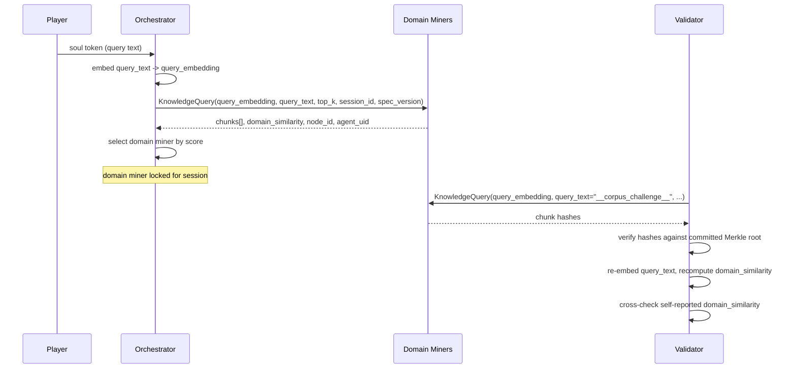
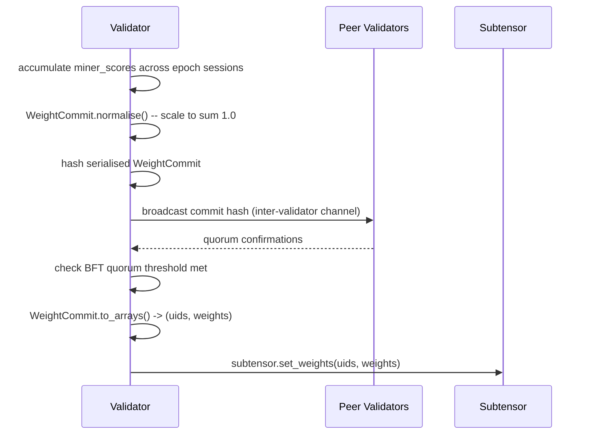

# Synapse Protocol — Narrative Network (Subnet 42)

**Subnet:** Narrative Network, SN42
**Protocol version:** defined by `SPEC_VERSION` in `subnet_config`

---

## Overview

The wire protocol defines three named synapse types used across the subnet. Two are `bt.Synapse` subclasses transmitted over Bittensor's axon/dendrite transport: `KnowledgeQuery` and `NarrativeHop`. The third, `WeightCommit`, is an internal validator data structure — never transmitted as a synapse — used to construct and commit weight updates via BFT quorum.

**Design constraints:**

- Request fields with no default are required; all response fields are `Optional` defaulting to `None`.
- All embedding vectors are flat `list[float]` (JSON-serialisable). No numpy types may appear on the wire.
- This file must stay free of business logic. It is imported by miners, validators, and the orchestrator alike.
- Constants (`EMBEDDING_DIM`, `SPEC_VERSION`, `MAX_CHOICE_CARDS`, `MIN_CHOICE_CARDS`) are sourced from `subnet_config`, not hardcoded here.

---

## Type Aliases

```python
NodeID      = str           # opaque graph node identifier
SessionID   = str           # UUID v4
ChunkHash   = str           # hex-encoded SHA-256 of chunk text
EmbeddingVec = list[float]  # flat vector, length == EMBEDDING_DIM (768)
```

---

## Synapse 1: KnowledgeQuery

**Direction:** orchestrator → domain miners (on session entry); validator → domain miners (groundedness and corpus integrity checks).

### Request Fields

| Field | Type | Constraints | Required |
|-------|------|-------------|----------|
| `query_embedding` | `EmbeddingVec` | length == `EMBEDDING_DIM` (768) | yes |
| `query_text` | `str` | max 2000 chars; `__corpus_challenge__` reserved for Merkle challenges | yes |
| `top_k` | `int` | 1–20; default sourced from config | yes |
| `session_id` | `SessionID` | UUID v4 | yes |
| `spec_version` | `str` | must match `SPEC_VERSION` | yes |

### Response Fields

| Field | Type | Notes |
|-------|------|-------|
| `chunks` | `list[dict] \| None` | each dict: `{text, source_id, hash: ChunkHash, score: float, node_id: NodeID}` |
| `domain_similarity` | `float \| None` | cosine similarity 0–1, self-reported; validator re-derives independently |
| `node_id` | `NodeID \| None` | miner's assigned node |
| `agent_uid` | `int \| None` | miner's metagraph UID |

### Validator Verification

The validator independently re-embeds `query_text` and recomputes cosine similarity against the miner's domain centroid. The self-reported `domain_similarity` is not trusted; it is cross-checked against the validator's own derivation to detect fabricated scores.

**Corpus integrity challenges:** when `query_text == "__corpus_challenge__"`, the validator is issuing a Merkle corpus integrity challenge rather than a live query. Miners must return chunk hashes consistent with their committed corpus Merkle root. Responses failing this check are penalised as corpus fraud.

---

## Synapse 2: NarrativeHop

**Direction:** orchestrator → narrative miners (once per player path choice).

This is the core game-loop synapse. It is fired each time a player selects a choice card and the session advances to a new node. All registered miners receive the request; all valid responses are scored. The highest scorer wins the session step and earns traversal credits.

### Request Fields

| Field | Type | Constraints | Required |
|-------|------|-------------|----------|
| `destination_node_id` | `NodeID` | target node the player chose | yes |
| `player_path` | `list[NodeID]` | ordered traversal history, max 50 entries | yes |
| `path_embeddings` | `list[EmbeddingVec]` | one 768-dim vector per prior hop, for coherence scoring | yes |
| `prior_narrative` | `str` | last passage shown to player, max 4000 chars | yes |
| `retrieved_chunks` | `list[dict]` | chunks from domain miner, same shape as `KnowledgeQuery` chunk dicts | yes |
| `session_id` | `SessionID` | UUID v4 | yes |
| `spec_version` | `str` | must match `SPEC_VERSION` | yes |
| `integration_notice` | `str \| None` | optional foreshadowing hint, present only during bridge window | no |

### Response Fields

| Field | Type | Constraints |
|-------|------|-------------|
| `narrative_passage` | `str \| None` | 200–400 tokens; second-person present tense |
| `choice_cards` | `list[ChoiceCard] \| None` | `MIN_CHOICE_CARDS`–`MAX_CHOICE_CARDS` cards (2–4) |
| `knowledge_synthesis` | `str \| None` | 1–3 sentences; max 600 chars; scored for groundedness against `retrieved_chunks` |
| `passage_embedding` | `EmbeddingVec \| None` | 768-dim embedding of `narrative_passage`; used for coherence scoring |
| `agent_uid` | `int \| None` | miner's metagraph UID |

### ChoiceCard (inline model)

`ChoiceCard` is not a synapse type. It is an inline Pydantic model embedded in `NarrativeHop` responses.

| Field | Type | Notes |
|-------|------|-------|
| `text` | `str` | player-facing label, short |
| `destination_node_id` | `NodeID` | target node if chosen |
| `edge_weight_delta` | `float` | signed delta applied to the edge weight on traversal |
| `thematic_color` | `str` | hex colour string; drives UI rendering |

---

## Synapse 3: WeightCommit (internal validator structure)

`WeightCommit` is **not** a `bt.Synapse`. It is a pure Python dataclass used internally by the validator to accumulate, normalise, and commit miner weight updates. It is never placed on the axon transport.

### Fields

| Field | Type | Notes |
|-------|------|-------|
| `epoch` | `int` | Bittensor block epoch of this commit |
| `validator_uid` | `int` | metagraph UID of the committing validator |
| `miner_scores` | `dict[int, float]` | uid → normalised weight in range 0–1 |
| `session_count` | `int` | number of sessions scored in this epoch |
| `mean_score` | `float` | mean raw score across all scored sessions |

### Methods

**`normalise() -> None`**

Scales all values in `miner_scores` so they sum to 1.0. Called before `to_arrays()`. A no-op if the sum is already 1.0 within floating-point tolerance.

**`to_arrays() -> tuple[list[int], list[float]]`**

Returns `(uids, weights)` as parallel lists suitable for passing directly to `subtensor.set_weights()`.

### BFT Quorum

Before calling `set_weights()`, the validator hashes the serialised `WeightCommit` and broadcasts that hash to peer validators over the subnet's inter-validator channel. A Byzantine Fault Tolerant quorum of peer confirmations is required before the commit proceeds. This prevents a single compromised validator from unilaterally distorting the weight distribution.

---

## Sequence Diagrams

### Session Entry — KnowledgeQuery



### Narrative Hop — Game Loop

```mermaid
sequenceDiagram
    participant P as Player
    participant O as Orchestrator
    participant DM as Domain Miner (locked)
    participant NM as Narrative Miners (all)
    participant V as Validator

    P->>O: choice_card selected (destination_node_id)
    O->>DM: KnowledgeQuery(query_embedding, query_text, top_k, session_id, spec_version)
    DM-->>O: retrieved_chunks[]

    O->>NM: NarrativeHop(destination_node_id, player_path, path_embeddings,\nprior_narrative, retrieved_chunks, session_id, spec_version)
    NM-->>O: narrative_passage, choice_cards[], knowledge_synthesis,\npassage_embedding, agent_uid

    O->>V: forward all miner responses for scoring
    V->>V: score each response (groundedness, coherence, choice card validity)
    V->>V: rank responses; highest scorer wins step
    V-->>O: winning response
    O->>P: render narrative_passage + choice_cards[]
```

### Validator Scoring and Weight Commit



---

## Protocol Rules Summary

| Rule | Detail |
|------|--------|
| Required vs optional | Request fields with no default are required. All response fields are `Optional[T] = None`. |
| Embedding format | Flat `list[float]`, length `EMBEDDING_DIM` (768). No numpy arrays on the wire. |
| Business logic | This protocol file is import-only. No scoring, decay, or routing logic belongs here. |
| Version gating | Miners and validators reject messages where `spec_version != SPEC_VERSION`. |
| Corpus challenge | `query_text == "__corpus_challenge__"` is a reserved sentinel for Merkle integrity checks. |
| Choice card count | Responses must include between `MIN_CHOICE_CARDS` and `MAX_CHOICE_CARDS` cards (2–4). |
| Passage length | `narrative_passage` targets 200–400 tokens, second-person present tense. |
| Synthesis length | `knowledge_synthesis` max 600 chars; grounded in `retrieved_chunks`. |
| Path depth | `player_path` max 50 nodes; older entries may be truncated by orchestrator before sending. |
| Weight commit | `WeightCommit` is never transmitted as a synapse. BFT quorum required before `set_weights()`. |
