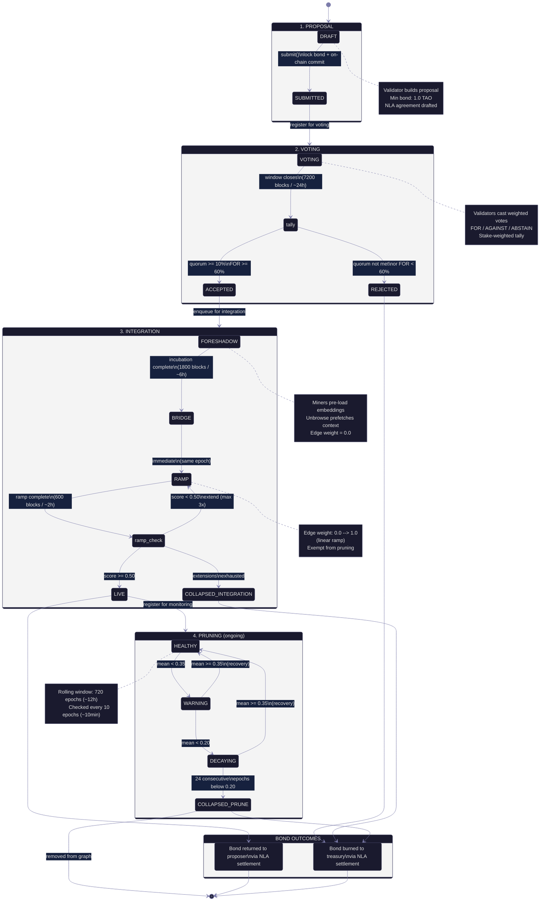

```mermaid
%%{init: {
  'theme': 'base',
  'themeVariables': {
    'primaryColor': '#1a1a2e',
    'primaryTextColor': '#e0e0e0',
    'primaryBorderColor': '#4a4a6a',
    'lineColor': '#7c7caa',
    'secondaryColor': '#16213e',
    'tertiaryColor': '#0f3460',
    'noteTextColor': '#e0e0e0',
    'noteBkgColor': '#1a1a2e',
    'noteBorderColor': '#4a4a6a'
  }
}}%%

stateDiagram-v2
    direction TB

    %% ─────────────────────────────────────────────
    %% PROPOSAL PHASE
    %% ─────────────────────────────────────────────
    state "1. PROPOSAL" as proposal_phase {
        DRAFT --> SUBMITTED : submit()\nlock bond + on-chain commit
        note right of DRAFT
            Validator builds proposal
            Min bond: 1.0 TAO
            NLA agreement drafted
        end note
    }

    %% ─────────────────────────────────────────────
    %% VOTING PHASE
    %% ─────────────────────────────────────────────
    state "2. VOTING" as voting_phase {
        VOTING --> tally : window closes\n(7200 blocks / ~24h)
        state tally <<choice>>
        tally --> ACCEPTED : quorum >= 10%\nFOR >= 60%
        tally --> REJECTED : quorum not met\nor FOR < 60%
        note right of VOTING
            Validators cast weighted votes
            FOR / AGAINST / ABSTAIN
            Stake-weighted tally
        end note
    }

    %% ─────────────────────────────────────────────
    %% INTEGRATION PHASE
    %% ─────────────────────────────────────────────
    state "3. INTEGRATION" as integration_phase {
        FORESHADOW --> BRIDGE : incubation complete\n(1800 blocks / ~6h)
        BRIDGE --> RAMP : immediate\n(same epoch)
        RAMP --> ramp_check : ramp complete\n(600 blocks / ~2h)
        state ramp_check <<choice>>
        ramp_check --> LIVE : score >= 0.50
        ramp_check --> RAMP : score < 0.50\nextend (max 3x)
        ramp_check --> COLLAPSED_INTEGRATION : extensions\nexhausted

        note right of FORESHADOW
            Miners pre-load embeddings
            Unbrowse prefetches context
            Edge weight = 0.0
        end note
        note right of RAMP
            Edge weight: 0.0 --> 1.0
            (linear ramp)
            Exempt from pruning
        end note
    }

    %% ─────────────────────────────────────────────
    %% PRUNING PHASE (ongoing after LIVE)
    %% ─────────────────────────────────────────────
    state "4. PRUNING (ongoing)" as pruning_phase {
        HEALTHY --> WARNING : mean < 0.35
        WARNING --> DECAYING : mean < 0.20
        DECAYING --> COLLAPSED_PRUNE : 24 consecutive\nepochs below 0.20
        WARNING --> HEALTHY : mean >= 0.35\n(recovery)
        DECAYING --> HEALTHY : mean >= 0.35\n(recovery)

        note right of HEALTHY
            Rolling window: 720 epochs (~12h)
            Checked every 10 epochs (~10min)
        end note
    }

    %% ─────────────────────────────────────────────
    %% BOND OUTCOMES
    %% ─────────────────────────────────────────────
    state "BOND OUTCOMES" as bond_outcomes {
        BOND_RETURNED : Bond returned to proposer\nvia NLA settlement
        BOND_BURNED : Bond burned to treasury\nvia NLA settlement
    }

    %% ─────────────────────────────────────────────
    %% TRANSITIONS BETWEEN PHASES
    %% ─────────────────────────────────────────────

    [*] --> proposal_phase

    SUBMITTED --> voting_phase : register for voting

    ACCEPTED --> integration_phase : enqueue for integration
    REJECTED --> BOND_BURNED

    LIVE --> pruning_phase : register for monitoring
    LIVE --> BOND_RETURNED

    COLLAPSED_INTEGRATION --> BOND_BURNED
    COLLAPSED_PRUNE --> BOND_BURNED
    COLLAPSED_PRUNE --> [*] : removed from graph

    BOND_RETURNED --> [*]
    BOND_BURNED --> [*]
```
